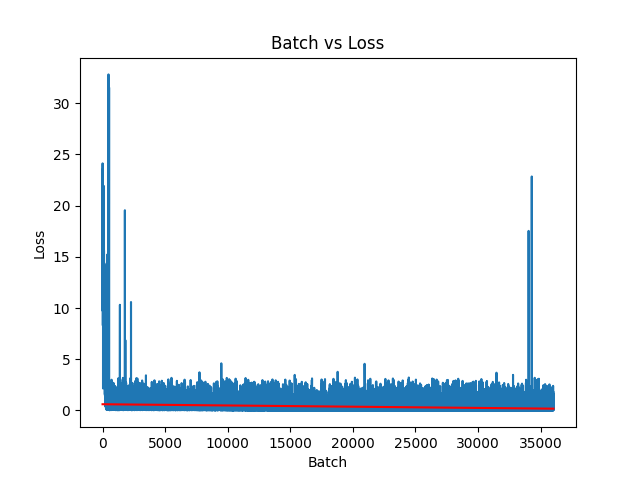

## Flan-UL2-Dolly - Commercially Viable LLM
## [Available On HuggingFace](https://huggingface.co/coniferlabs/flan-ul2-dolly-lora)

This repository contains code for leveraging the [Dolly 15K](https://github.com/databrickslabs/dolly/tree/master/data) dataset [released by Databricks](https://github.com/databrickslabs/dolly/tree/master/data) to fine tune the [Flan-UL2](https://huggingface.co/google/flan-ul2) model, leveraging recent advances in instruction tuning. Flan-UL2 has been shown to outperform Flan-T5 XXL on a number of metrics and has a 4x improvement in receptive field (2048 vs 512 tokens). Additionally, both the Flan-UL2 model and the Dolly 15K dataset have the significant advantage of a commercially viable license.

### Resource Considerations

A goal of this project was to produce this model with a limited budget demonstrating the ability train a robust, commercially viable LLM using systems available to even small businesses and individuals. This had the added benefit of personally saving me money as well :). To achieve this a server was rented on [vultr.com](vultr.com) with the following pricing/specs:
- Pricing: $1.302/hour
- OS: Ubuntu 22.10 x64
- 6 vCPUs
- 60 GB CPU RAM
- 40 GB GPU RAM (1/2 x A100)

To dramatically reduce memory footprint and compute requirements [Low Rank Adaption(LoRA)](https://huggingface.co/docs/diffusers/training/lora) was used as opposed to finetuning the entire network. Additionally, the Flan-UL2 model was loaded and trained in 8 bit mode, also greatly reducing memory requirements. Finally, a batch size of 1 was used with 8 gradient accumulation steps. Here is a list of training parameters used:
- Epochs: 3
- Learning Rate: 1e-4
- Batch Size: 1
- Gradient Accumulation Steps: 8
- 8 Bit Mode: Yes

### Why?

Rapid recent advancements in the natural language processing (NLP) space have been extraordinary. Large Language Models (LLMs) like Meta's LLaMA are getting a lot of attention with their remarkable generative abilities however, many people are looking at the implications of these projects and looking for ways to leverage the technology in a commercial setting. Unfortunately, many LLMs (ie LLaMA, Vicuna) are limited by their licensing, restricting opportunities for usage within businesses and products.

To address this issue, the entirely open-source [Flan-UL2 model](https://huggingface.co/google/flan-ul2), built by Google on the [Flan-T5](https://arxiv.org/abs/2210.11416) encoder-decoder framework, is an excellent alternative to LLMs with more restrictive licensing. Flan-UL2 is accessible for commercial applications and fine-tuned on academic NLP tasks, providing exceptional performance in comparison to models of similar size across various benchmarks. Additionally, with a receptive field of 2048 token is suitable for a number of LLM tasks including [Retrieval Augmented Generation (RAG)](https://arxiv.org/abs/2005.11401).

Additionally, the use of the Dolly 15K dataset has the advantage of being a fully open source, human generated dataset with permissive licensing for commercial applications. This is in contract to synthetic datasets (ie Alpaca) generated using ChatGPT API's which are limited by OpenAI's Terms of Service and do not have the natural variation and depth of human generated content.


### Environment Setup

```
conda conifer create -f environment.yml
conda activate conifer
pip install -r requirements.txt
```

If you are running in a Unix environment and loading the model in 8 bit mode, you may encounter this error from bitsandbytes:

```
UserWarning: The installed version of bitsandbytes was compiled without GPU support. 8-bit optimizers and GPU quantization are unavailable.
```

 If that happens, [try this workaround](https://github.com/TimDettmers/bitsandbytes/issues/156#issuecomment-1462329713):

```
cd ~/miniconda3/envs/conifer/lib/python3.10/site-packages/bitsandbytes/
cp libbitsandbytes_cuda120.so libbitsandbytes_cpu.so
```

### Usage

```
from transformers import AutoModelForSeq2SeqLM, AutoTokenizer
from peft import PeftModel, PeftConfig

prompt = "Write a story about an lamb named Dolly that went to the zoo."

peft_model_id = 'coniferlabs/flan-ul2-dolly-lora'
config = PeftConfig.from_pretrained(peft_model_id)
model = AutoModelForSeq2SeqLM.from_pretrained(config.base_model_name_or_path, device_map="auto", load_in_8bit=True)
model = PeftModel.from_pretrained(model, peft_model_id, device_map={'': 0})
tokenizer = AutoTokenizer.from_pretrained(config.base_model_name_or_path)
model.eval()

tokenized_text = tokenizer.encode(prompt, return_tensors="pt").to("cuda")
outputs = model.generate(input_ids=tokenized_text, parameters={"min_length": 10, "max_length": 250})
tokenizer.batch_decode(outputs, skip_special_tokens=True)

###
```


### Training

The following command will finetune the Flan-UL2. (1 epoch = ~13 hours on 1/2 x A100)

```
python train_lora.py
```

### Results

| Epoch | Train Loss | Eval Loss  |
|-------|------------|------------|
| 1     | 6456.1367  |  852.3842  |
| 2     | 3738.73442 |  835.1929  |
| 3     | 3719.4336  |  834.9722  |



Loss Trendline: y = -1.1981345834547134e-05x + 0.6018711605440453
